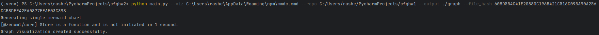
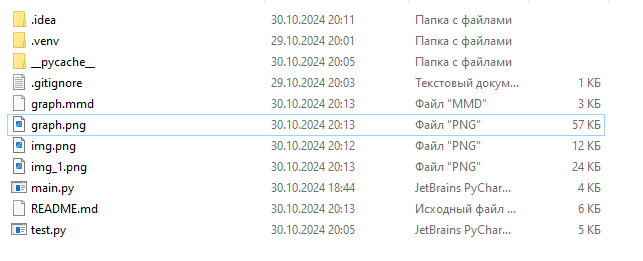
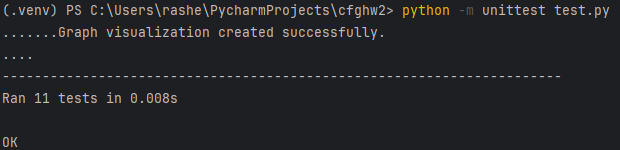

Задание №2
Разработать инструмент командной строки для визуализации графа
зависимостей, включая транзитивные зависимости. Сторонние средства для
получения зависимостей использовать нельзя.
Зависимости определяются для git-репозитория. Для описания графа
зависимостей используется представление Mermaid. Визуализатор должен
выводить результат в виде сообщения об успешном выполнении и сохранять граф
в файле формата png.
Построить граф зависимостей для коммитов, в узлах которого содержатся
сообщения. Граф необходимо строить только для тех коммитов, где фигурирует
файл с заданным хеш-значением.
Ключами командной строки задаются:
• Путь к программе для визуализации графов.
• Путь к анализируемому репозиторию.
• Путь к файлу с изображением графа зависимостей.
• Файл с заданным хеш-значением в репозитории.
Все функции визуализатора зависимостей должны быть покрыты тестами.

Описание функций:
find_file_by_hash(repo_path, target_hash):
Ищет файл по заданному хешу в указанном пути репозитория. 
Для каждого файла в директории вычисляет хеш SHA256 и сравнивает его с целевым. 
Если файл найден, возвращает путь к нему, в противном случае возвращает None.

get_commit_history(repo_path, file_path):
Получает историю коммитов для указанного файла в репозитории. 
Использует команду git log для извлечения всех коммитов, связанных с данным файлом, 
и возвращает список строк с хешами коммитов и сообщениями.

build_mermaid_graph(commits):
Создает граф в формате Mermaid на основе переданных коммитов. 
Каждая строка из истории коммитов обрабатывается для создания узлов и связей между ними. 
Возвращает строку, представляющую граф.

save_mermaid_file(mermaid_graph, output_path):
Сохраняет граф Mermaid в файл по указанному пути. 
Открывает файл в режиме записи с кодировкой UTF-8 и записывает в него содержимое графа.

generate_png_from_mermaid(mermaid_path, output_image_path, mermaid_tool_path):
Создает PNG-изображение из файла Mermaid, используя указанный инструмент (например, Mermaid CLI). 
Выполняет команду в оболочке и выводит сообщение об успешном создании изображения или об ошибке, 
если команда завершилась с ненулевым кодом возврата.

main():
Точка входа программы. Обрабатывает аргументы командной строки, проверяет существование указанных путей, 
находит файл по его хешу, получает историю коммитов, строит граф Mermaid и генерирует PNG-изображение.

Для запуска программы необходимо ввести следующую команду в консоль:
python main.py --viz C:\Users\rashe\AppData\Roaming\npm\mmdc.cmd --repo C:/Users/rashe/PycharmProjects/cfghw1 --output ./graph --file_hash 608D554C41E20880C196B421C516C095A90A256CCB8DEF42EA0877EFAF03C398

В общем случае:
python <имя файла основной программы> --viz <путь к программе для визуализации графов> --repo <путь к анализируемому репозиторию> --output <путь к файлу с изображением графа зависимостей> --file_hash <файл с заданным хеш-значением в репозитории>

Демонстрация работы программы

Так как не удается прикрепить итоговый PNG файл, он находится в самом репозитории, так же как и .mmd файл.

Результаты тестирования:

